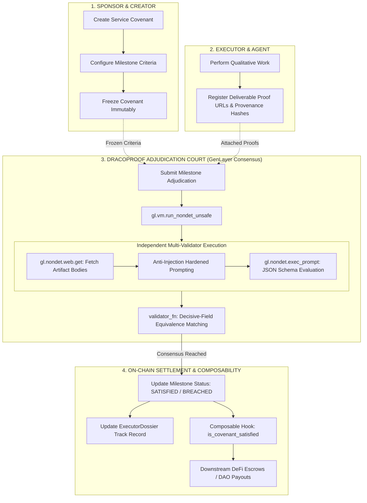

# 🐉 DRACOPROOF

### Autonomous AI Covenant & Deliverable Milestone Adjudication Protocol

[](https://draco-proof-tau.vercel.app/)
[](https://explorer-studio.genlayer.com/address/0x7626cFf8be3470FD0A29762C682b8c2099463720)
[](LICENSE)

> **"A promise in code is only as strong as the oracle that verifies its fulfillment."**  
> DracoProof brings decentralized, consensus-driven qualitative milestone adjudication to GenLayer Intelligent Contracts.

---

## 🌐 Canonical Live Deployment

- **Live Application:** [https://draco-proof-tau.vercel.app/](https://draco-proof-tau.vercel.app/)
- **Network:** GenLayer StudioNet (Chain ID `61999`)
- **Contract Address:** [`0x7626cFf8be3470FD0A29762C682b8c2099463720`](https://explorer-studio.genlayer.com/address/0x7626cFf8be3470FD0A29762C682b8c2099463720)
- **Explorer:** [GenLayer Studio Explorer](https://explorer-studio.genlayer.com/address/0x7626cFf8be3470FD0A29762C682b8c2099463720)
- **Class Name:** `DracoProof`
- **SDK Compatibility:** `genlayer-js` `^1.1.8`

---

## 🏛️ Executive Overview

In the emerging economy of autonomous AI agents, decentralized DAOs, and high-stakes freelance service contracts, participants enter into **Service Level Covenants**. These agreements encompass complex, qualitative deliverables:
- Comprehensive smart contract security audits.
- Training and fine-tuning specialized algorithmic models.
- Publishing verified research datasets and benchmark evaluations.
- Deploying containerized production microservices and meeting uptime telemetry mandates.

Traditional deterministic blockchains cannot verify these deliverables—they lack live internet access and semantic reasoning capabilities. Consequently, existing ecosystems rely on centralized multisigs, trusted intermediaries, or subjective DAO voting.

**DracoProof** solves this paradigm through a **Decentralized AI Covenant Adjudication Engine** natively built on GenLayer.

---

## 🐉 The Dragon Architecture Flowchart



### ASCII Architectural Dragon Pipeline

```
  ========================================================================================
  🐉  D R A C O P R O O F   A R C H I T E C T U R A L   D R A G O N   P I P E L I N E  🐉
  ========================================================================================

   [ SPONSOR ]                          [ EXECUTOR ]                         [ GENLAYER ]
        |                                    |                                    |
   (1) create_covenant()                     |                                    |
        |---> Drafts Milestones              |                                    |
        |                                    |                                    |
   (2) set_milestone_criteria()              |                                    |
        |---> Bounded Technical Rules        |                                    |
        |                                    |                                    |
   (3) freeze_covenant()                     |                                    |
        |=== Permanent Immature Lock ===>    |                                    |
                                             |                                    |
                                        (4) register_deliverable_proof()          |
                                             |---> Provenance SHA256 & URLs       |
                                             |                                    |
                                        (5) adjudicate_milestone() -------------> |
                                                                                  |
                                                                        [ gl.vm.run_nondet_unsafe ]
                                                                        * Multi-Validator Web Fetch
                                                                        * Anti-Injection Evaluation
                                                                        * Decisive-Field Matching
                                                                                  |
                                            <=== Settle Milestone State <=========|
                                             |
   +-----------------------------------------+-----------------------------------------+
   |                                                                                   |
   v                                                                                   v
[ EXECUTOR DOSSIER ]                                                      [ COMPOSABILITY HOOK ]
* Total Covenants Completed                                               is_covenant_satisfied()
* Satisfied / Breached Ratios                                             -> Automated Escrow Release
* Immutable Historical Log                                                -> Real-time DAO Governance
```

---

## ⚡ Key Architectural Invariants

### 1. Permanent Covenant Freezing
Covenants begin in an editable `DRAFT` state where sponsors configure granular milestones and clear acceptance criteria. Once `freeze_covenant()` is called, the contract verifies that all milestones possess valid criteria and locks the covenant permanently. No criteria or scope parameters can ever be altered.

### 2. Decoupled Deliverable Evidence Registration
Deliverables are registered in the `ProofVault` with public HTTP/HTTPS endpoints, category tags (`CODE_REPOSITORY`, `AUDIT_REPORT`, `DEPLOYMENT_ENDPOINT`, etc.), and optional 64-character hexadecimal SHA-256 provenance digests. Registering evidence does not grant approval; it merely establishes an auditable submission record.

### 3. Storage-Isolated Non-Deterministic Execution
In GenVM, non-deterministic closures executed during consensus must not mutate or directly access persistent contract storage. DracoProof strictly copies all required state (titles, scope, criteria strings, proof URLs) into plain Python memory before entering `evaluate()` and `validator_fn()`. This invariant is verified through AST static analysis unit tests (`test_stage3_ast_storage_isolation.py`).

### 4. Decisive-Field Equivalence Consensus
Validators execute `run_nondet_unsafe(evaluate, validator_fn)`. The `validator_fn` enforces:
- Proper leader return structure (`isinstance(leader_result, gl.vm.Return)`).
- Schema validation over criteria indices and proof attribution.
- Independent re-execution on the validator node.
- Decisive structured key equality (`_decisive_verdict_key`: `source_integrity|verdict:used_proof_ids...`), ensuring multi-validator consensus settles on substantive rulings while tolerating stylistic prose variations in explanatory summaries.

### 5. Downstream Composability & Executor Dossiers
Third-party smart contracts (such as DeFi bounty escrows or staking protocols) can call:
```python
draco_proof.is_covenant_satisfied(covenant_id, milestone_index) -> bool
```
This enables trustless, automated release of escrowed funds upon finalized GenLayer consensus without requiring human or centralized intervention.

---

## 🚀 Getting Started

### Prerequisites
- Node.js `>= 18.0.0`
- Python `>= 3.10`
- `genlayer-js` `^1.1.8`

### Local Setup
```bash
# Clone repository
git clone https://github.com/k-beee/DracoProof.git
cd DracoProof

# Install frontend dependencies
npm install

# Run local development server
npm run dev
```

### Direct Unit Testing
```bash
# Execute direct GenVM test suite
pytest tests/direct/ -v
```

---

## 📜 License
MIT License. Built for the GenLayer Ecosystem.
